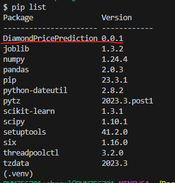
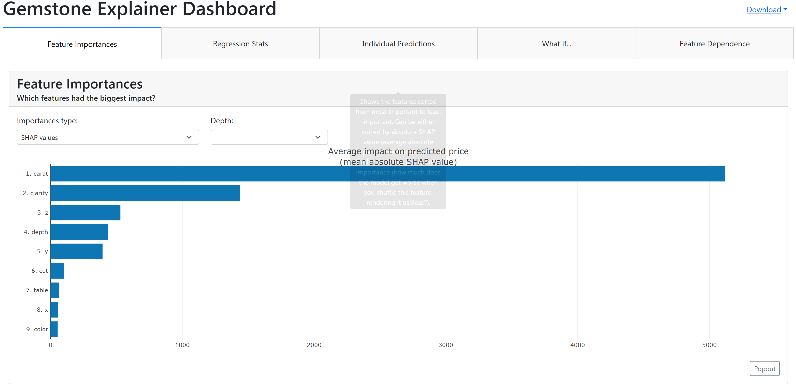

# Gemstone Price Prediction

## Problem Statement

```You are hired by a company Gem Stones Co Ltd. You are provided with the dataset containing the prices and other attributes of almost 27,000 cubic gemstone (which is an inexpensive diamond alternative with many of the same qualities as a diamond). The company is earning different profits on different prize slots. You have to help the company in predicting the price for the stone on the basis of the details given in the dataset so it can distinguish between higher profitable stones and lower profitable stones so as to have a better profit share. Also, provide them with the best 5 attributes that are most important.```

## Data Dictionary

* Carat	- Carat weight of the gemstone.
* Cut - Describe the cut quality of the gemstone. Quality is increasing order Fair, Good, Very Good, Premium, Ideal.
* Color - Colour of the gemstone.With D being the best and J the worst.
* Clarity - Gemstone Clarity refers to the absence of the Inclusions and Blemishes. (In order from Best to Worst, FL = flawless, I3= level 3 inclusions) FL, IF, VVS1, VVS2, VS1, VS2, SI1, SI2, I1, I2, I3
* Depth	- The Height of a gemstone, measured from the Culet to the table, divided by its average Girdle Diameter.
* Table - The Width of the gemstone's Table expressed as a Percentage of its Average Diameter.
* Price	- the Price of the gemstone.
* X	- Length of the gemstone in mm.
* Y	- Width of the gemstone in mm.
* Z	- Height of the gemstone in mm.


### Create a project folder
```bash
mkdir <"project folder name">
```

### Initialise git
```bash
git init
```

### Add file to stage
```bash
git add <"file name">
```

### Commit fils to git
```bash
git commit -m <"commit message">
```

### Push the branch to remote github
```bash
git push -u origin <"branch name">
```

### Run init_setup.sh to setup development environment
```bash
bash <'filename'>.sh
```
### Ways to install project as local package
#### 1. using setup.py
```bash
python setup.py install
```
#### 2. having '-e .' in requirement.txt 
```bash
pip install -r requirement.txt
```



## Acivate environment
source activate ./env

## Artifacts
Outputs of all the components:
I/P --> Raw data --> Data Ingestion --> O/P Train|Test data split
I/P --> Data Transformation --> O/P Processed data

## Pipelines
### Training Pipeline
    * Data Ingestion (fetched data from source)
    * Data Transformation (Feature Engineering, Data Preprocessing)
    * Model Builing (Create a model using the processed data)

### Prediction Pipeline
    * Two types of prediction pipeline
        * Single record prediction
        * Batch prediction

## Deployed Links
* https://gemstonepriceprediction.streamlit.app/
  

## Explainer Dashboard

* Feature Importance
* Regression Stats
* Individual Predictions
* What if?
* Feature Dependence

```bash
python dashboard.py
```



